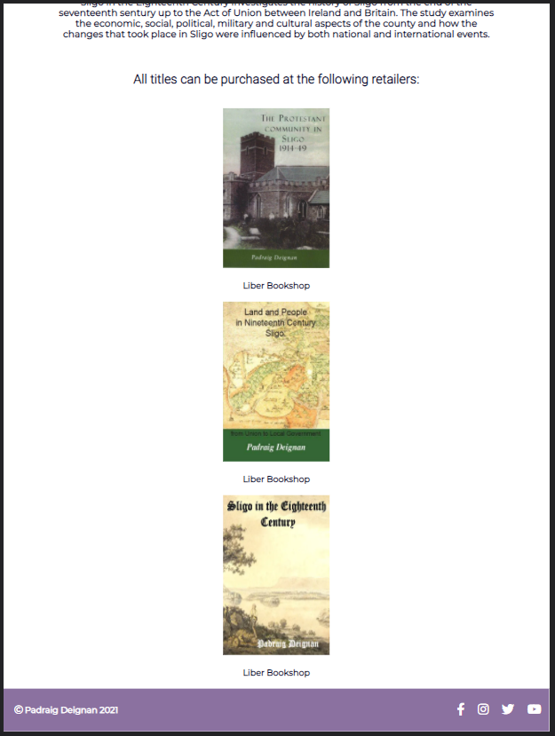

# Padraig Deignan

This is a site that highlights a very talented and locally known historian/author in the heart of Sligo, Ireland. Padraig Deignan is a PhD graduate of NUI Maynooth and also a graduate of NUI Galway where he was awarded a B.A., M.A., a Higher Diploma in Education and a Fellowship of the National University of Ireland. He has worked as a teacher for a number of years. Along with the publication of numerous articles he published a book ‘The Protestant Community in Sligo, 1914-49’ in 2010, 'Land and People in Nineteenth Century Sligo: From Union to Local Government' in 2015, and 'Sligo in the Eighteenth Century' in 2021. 

This site provides a platform for people, both nationally and internationally, who are interested in Irish History, wish to possibly connect with Padraig Deignan, wish to purchase one of his books, or possibly wish to collaborate with him. It amalgamates information from several different sources and provides links to these so users can read about the man himself, find out a little bit about his books, and get in contact if they wish.

The live link can be found here - https://johnathonanon.github.io/padraig-deignan/index.html

## Features

### Existing Features

- **Navigation Bar**

  - Featured on all five pages, the full responsive navigation bar includes links to the 

    Home | About | Books | Media | Contact

    and is identical in each page to allow for easy navigation.

  - This will allow users to navigate between the pages on the website without needing to use the "back" button for a more user friendly experience.

  - The current page appears with a line underneath, allowing the user to quickly and easily understand what page they are currently viewing.

  

  - The nav bar is coded to center above the social media icons at < 800px and become a hamburger icon with a dropdown menu at < 600px screen width, which again makes for a friendlier user experience.

  

  

- **Social Media Icons**

  - Responsive social media icons for the purpose of the user to connect with the Author/Historian in order to get in touch, or learn more about Padraig Deignan. These contain links to the home pages of the included sites for those social media sites Padraig is not currently a member of. All sites open in a new tab. At < 600px these center under the navbar for a neater user experience. The icons change colour when hovered on.

- **The Index Page**

  - This introduces the user to what the website is about. This is a simple visual representation that the website is about Padraig Deignan and who he is (Author and Historian). A books section has a visual representation of his work, and clicking on the images redirects to the books.html section of the relevant title.

  

- **About**

  - The about section will allow the user to read a short section about the background of Padraig Deignan, and how he became who is today. This section will allow the user to get a more in-depth perception of who Padraig Deignan is as an Author/Historian. It will allow the user to develop a connection with the subject of the site.

  

- **Books**

  - This section will allow the user to purchase books via included links and also view the books Padraig Deignan has written. They will have brief sections on each book describing the contents.

  

  

- **Media**

  - In this section the user can view videos featuring Padraig Deignan.

  

- **Contact**

  - This section contains a form which will allow the user to contact Padraig by email. All fields are required, meaning the from has to filled correctly in order to be submitted. Once all fields are entered and submit button is pressed the user is redirected to the thanks page.

  
  
  
  
  

- **Footer**

  - The footer is has a copyright of the owner and the year it was published. The right hand side of the footer will contain icons that are responsive/interactive that will bring the user to Padraig Degnan's Social media outlets. These icons are removed at lower screen sizes to make the site neater for the user.

  
  

### Features Left to Implement

- As of now the contact form only brings the user to the thanks.html file. In the future this form should allow the user to send Padraig a message via email.

## Testing

The site has been consistently tested throughout its development. Any time a new feature was introduced or style change made, this was tested using chrome developer tools. Any unwanted behaviour was then fixed before moving on.

All html elements serve their intended purpose with no bugs found at time of submission. All styles work as intended and add to the overall user experience. The site has been stringently tested on a large number of different browsers and screen sizes both using emulators on dev tools as well as physical mobile devices and tablets. 

All links, both internal and external, have been checked and confirmed working on a multitude of browsers including Google Chrome, Mozilla Firefox, Microsoft Edge, and Safari. 

Any forms and videos act as intended. 

The site works as intented on all tested platforms.

One of the largest challenges faced when implementing media queries for smaller device sizes was that certain elements had been given size values in pixels at the start of development. This caused an unnecessary amount of time to be spent fixed broken style through the development process, however it also resulted in a better site and a greater understanding of the priciples behind html and css.

Efforts were made beginning, during, and at the end of development to optimise the site as best as possible. This included colour palette generators and contrast checkers for accessibility, the addition of alt attributes where necessary, reduction of image file sizes to help load times, and search engine optimisation.

### Validator Testing

- HTML
  - No errors were returned when passing through the official [W3C validator](https://validator.w3.org/nu/?doc=https%3A%2F%2Fcode-institute-org.github.io%2Flove-running-2.0%2Findex.html)
- CSS
  - No errors were found when passing through the official [(Jigsaw) validator](https://jigsaw.w3.org/css-validator/validator?uri=https%3A%2F%2Fvalidator.w3.org%2Fnu%2F%3Fdoc%3Dhttps%3A%2F%2Fcode-institute-org.github.io%2Flove-running-2.0%2Findex.html&profile=css3svg&usermedium=all&warning=1&vextwarning=&lang=en#css)

### Unfixed Bugs

You will need to mention unfixed bugs and why they were not fixed. This section should include shortcomings of the frameworks or technologies used. Although time can be a big variable to consider, paucity of time and difficulty understanding implementation is not a valid reason to leave bugs unfixed.

## Deployment

This section should describe the process you went through to deploy the project to a hosting platform (e.g. GitHub)

- The site was deployed to GitHub pages. The steps to deploy are as follows:
  - In the GitHub repository, navigate to the Settings tab
  - From the source section drop-down menu, select the Master Branch
  - Once the master branch has been selected, the page will be automatically refreshed with a detailed ribbon display to indicate the successful deployment.

The live link can be found here - https://johnathonanon.github.io/padraig-deignan/about.html

## Credits

http://padraigdeignan.simplesite.com/415329717 

https://www.w3schools.com/howto/howto_js_topnav_responsive.asp

https://dev.to/roccosangellino/how-to-build-a-simple-navbar-with-html-and-css-945

https://turbofuture.com/computers/How-to-Create-a-CSS-Stylesheet-with-Notepad#:~:text=The%20external%20style%20sheet%20can,will%20affect%20all%20the%20pages.&text=Any%20text%20editor%20can%20be,Today%20we%20will%20use%20Notepad

https://www.w3schools.com/howto/tryit.asp?filename=tryhow_css_topnav

### Content

- The text for the Home page was taken from Wikipedia Article A
- Instructions on how to implement form validation on the Sign Up page was taken from [Specific YouTube Tutorial](https://www.youtube.com/)
- The icons in the footer were taken from [Font Awesome](https://fontawesome.com/)

### Media

- The photos used on the home and sign up page are from This Open Source site
- The images used for the gallery page were taken from this other open source site

Congratulations on completing your Readme, you have made another big stride in the direction of being a developer!

## Other General Project Advice

Below you will find a couple of extra tips that may be helpful when completing your project. Remember that each of these projects will become part of your final portfolio so it’s important to allow enough time to showcase your best work!

- One of the most basic elements of keeping a healthy commit history is with the commit message. When getting started with your project, read through [this article](https://chris.beams.io/posts/git-commit/) by Chris Beams on How to Write a Git Commit Message
  - Make sure to keep the messages in the imperative mood
- When naming the files in your project directory, make sure to consider meaningful naming of files, point to specific names and sections of content.
  - For example, instead of naming an image used ‘image1.png’ consider naming it ‘landing_page_img.png’. This will ensure that there are clear file paths kept.
- Do some extra research on good and bad coding practices, there are a handful of useful articles to read, consider reviewing the following list when getting started:
  - [Writing Your Best Code](https://learn.shayhowe.com/html-css/writing-your-best-code/)
  - [HTML & CSS Coding Best Practices](https://medium.com/@inceptiondj.info/html-css-coding-best-practice-fadb9870a00f)
  - [Google HTML/CSS Style Guide](https://google.github.io/styleguide/htmlcssguide.html#General)

Getting started with your Portfolio Projects can be daunting, planning your project can make it a lot easier to tackle, take small steps to reach the final outcome and enjoy the process!